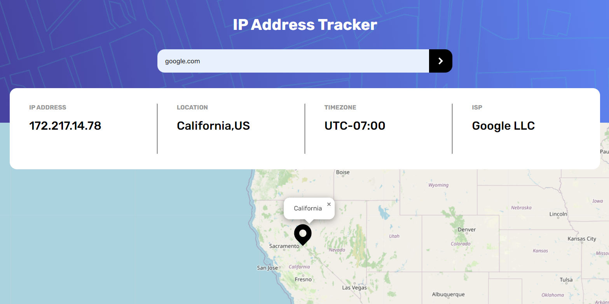

### The challenge

Users should be able to:

- View the optimal layout for each page depending on their device's screen size
- See hover states for all interactive elements on the page
- See their own IP address on the map on the initial page load
- Search for any IP addresses or domains and see the key information and location

### Links

- Solution URL: [Solution](https://www.frontendmentor.io/solutions/ip-tracker-p3A38UzW61)
- Live Site URL: [LIVE](https://cool-ip-domain-tracker.netlify.app/)

### Built with

- HTML5 
- SCSS 
- JAVASCRIPT

## Author

- Frontend Mentor - [Abrosss](https://www.frontendmentor.io/profile/Abrosss)
- [Twitter](https://twitter.com/ronessu)

